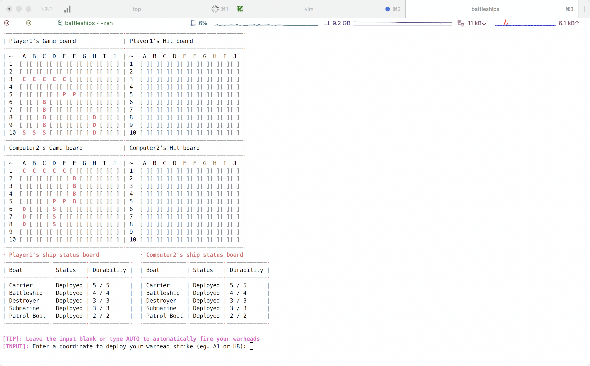
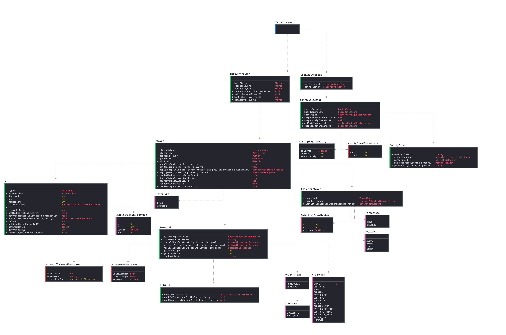
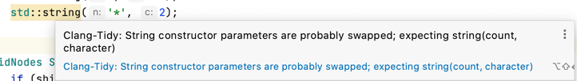
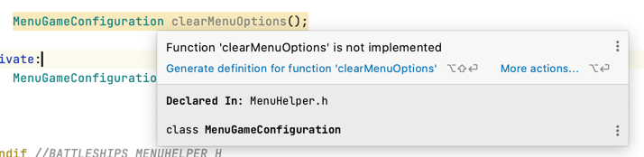
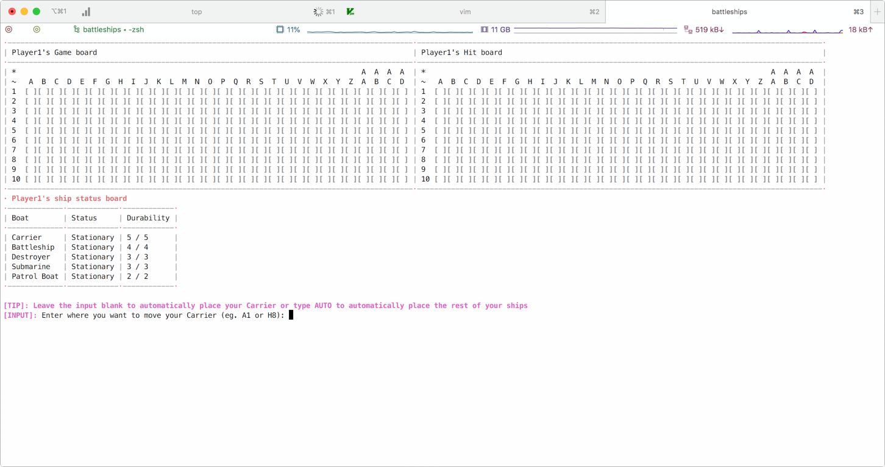
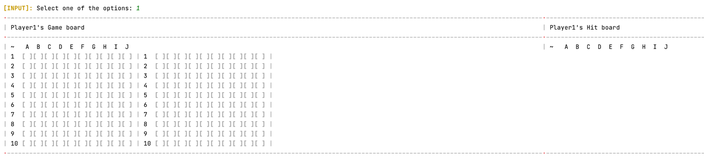
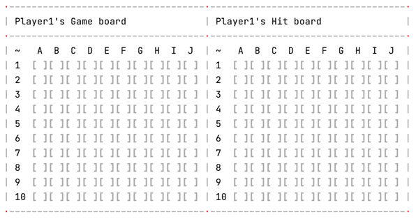
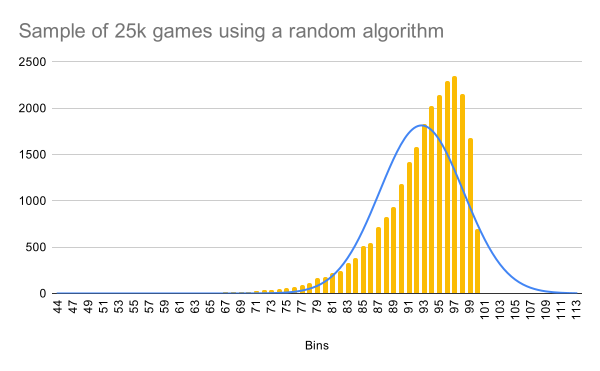
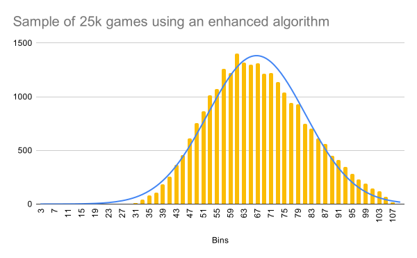
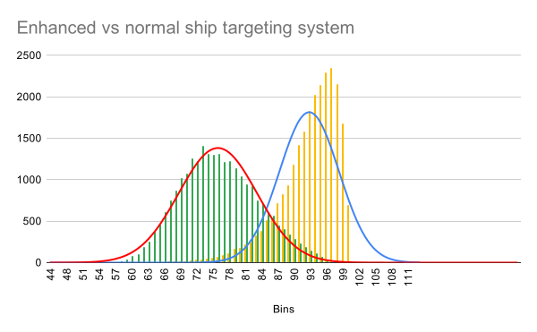

```
__________         __    __  .__                .__    .__              
\______   \_____ _/  |__/  |_|  |   ____   _____|  |__ |__|_____  ______
 |    |  _/\__  \\   __\   __\  | _/ __ \ /  ___/  |  \|  \____ \/  ___/
 |    |   \ / __ \|  |  |  | |  |_\  ___/ \___ \|   Y  \  |  |_> >___ \ 
 |______  /(____  /__|  |__| |____/\___  >____  >___|  /__|   __/____  >
        \/      \/                     \/     \/     \/   |__|       \/
```

## Implemented features

- Intuitive user interfaces and inputs
- Player vs player or computer
- Fully autonomous computer simulation modes
- Salvo game mode
- Hidden mines game mode
- Enhanced ship targeting algorithm

## Challenge Outline
### Summary & Overview

The challenge of this assignment is to create a playable version of the game battleships in the command line interface 
(CLI). A number of considerations have had to be made for different game modes and various configuration such as a 
dynamic number of ships and a configurable length of each ship - controlled from an ini configuration file.

The default source of the ini configuration file has been noted below and includes documentation stored as comments
(prefixed with `;`). 
```ini
; Defines the dimensions of the board as width * height.
; - Any value greater than or equal to 5 and less than or equal to 80 is valid.
; - Invalid values or repetitions of the Board definition will cause the program to throw and thus halt.
Board = 10x10

; Defines which ships are placed on the board.
; This follows the notation: <ship-name>, <health>, <ship-amount>.
; EG: The input "Carrier, 5, 3" would correlate to 3 carriers on the board all with a health of 5.
;
; - Duplicate ship-name values will result in an error and the program halting. If a ship is set to
;   a health of n, it can not be redefined later on, nor can the ship-amount value be redefined later on.
; - Setting the value to 0 is valid and will cause that specific ship not to be placed on the board,
;   however values less than 0 will also cause the program to halt.
; - Setting the ship health to a value greater than the width or height of the board will cause the program
;   to halt.
;
; - The ship-name must conform (case sensitive) to the following values: Carrier, Battleship, Destroyer,
;                                                                        Submarine, Patrol Boat
Ship = Carrier, 5, 1
Ship = Battleship, 4, 1
Ship = Destroyer, 3, 1
Ship = Submarine, 3, 1
Ship = Patrol Boat, 2, 1
```

The board has a minimum width and height of 5 and a max of 80. The ships are represented as `{ship-name}`, `{ship-health}`,
`{number-of-ships}`. For logical reasons the boat health which represents the length can not exceed the width or height
or the board, nor can it be less than 1. If any of the configuration options are invalid the program will alert the user
of this - providing the source of the offending line - and then exit the program execution.

In a standard game of battleships, there are two players who will play competitively against each other following a turn
based approach. Each player can see their own game board and a hit board, however they are not allowed to view the opposing
players boards, to prevent this happening I've implemented control sequences to clear the console and then displayed outputs
prompting the user to pass the device on to the next user.

One of the requirements were to include a number of different game modes, these included options for a computer versus 
computer simulation, a salvo game mode which means you can shoot as many missiles as you have boats remaining on the 
board and a version with mines which are randomly deployed and if hit will destroy the 8 adjacent nodes. Furthermore 
an advanced warhead deployment algorithm has been developed for the player vs computer and computer vs computer
simulation game modes which instead of being random would use a number of heuristics to choose where to fire the next
warheads (rather than a random algorithm).

Whilst playing against the computer both the players hit board and game board should be shown as well as the computers
boards to aid in testing. Below is a screenshot of what this looks like:



### Proposed Solution
#### Proposed components
- `GameGrid Class` 
    - **Displays the location and status of the players ships and - if applicable - the location and status of mines**
    - This will be implemented as a matrix using the built in `vector` class and will be set to the default `GridNodes`
      value, that being `UNKNOWN` 
    - Handles formatting the different `GridNodes` using a `formatNode(GridNodes node)` method
    - Validates and displays attempts to place `GridNodes` and series of `GridNodes` onto the `GameGrid`
    - Exposes a public API to:
        - Receive warhead strikes at any valid position on the board from the opposing player
        - Render the board (`renderBoard`), this will iterate through each row of the matrix, format the node as per the
          `formatNode` specification and writes this to a multiline `std::stringstream` for use by the method caller.
    - `HitGrid Class · Inherits from GameGrid`
        - **Displays where the player has attempted to hit and whether that hit was valid or invalid**
        - Exposes two public APIs to mark successful and unsuccessful warhead strikes
    
- `Player Class`
    - **Handles player interaction with the two boards and how the player interacts with the opposing player**
    - Handles storing and setting a reference to the opposing player
    - Stores a `vector` of the players `Ships` and their status
    - Expose public APIs to
        - Automatically deploy mines onto the `GameBoard`
        - Automatically and manually position ships on the `GameBoard`
        - Render the players `GameBoard` and `HitGrid` by delegating to their relevant `#renderBoard` methods
        - Render an interface to let the player deploy any ship that is stationary
        - Get the status of the players `Ships`
        - Deploy warheads at the opposing player after passing validation checks
        - Handle mine detonation logic w/ recursive functionality
        - A boolean which correlates to whether all their ships have sunk
    
- `Ship Class`
    - **Stores information pertaining to the status of the ships on the players `PlayerGrid`**
    - Stores the following properties:
        - Health
        - Max Lives
        - Status `(SUNK, STATIONARY, DEPLOYED)`
        - Orientation `(VERTICAL, HORIZONTAL)`
        - ID - random ID between `INT_MIN` and `INT_MAX` as a differentiator if there are multiple on the board
        - `Vector` of coordinates where the ship is placed if not `STATIONARY`
    - Exposes public setters and getters for all these properties
    - Exposes public APIs to:
        - Check if a given coordinate intersects with any value in the vector of stored coordinates
        - Get the name of the ship (eg: `Carrier` or `Battle Ship`)
    
- `ConfigFileParser Class`
    - **Used to parse the contents of a given configuration file**
    - Parses the contents of a given configuration file into a determinate structure, accessible via a number of 
      public APIs. The INI configuration specified in the brief allows duplicate keys which meant special consideration 
      has been implemented for this.
    - If validation fails for any reason, the reason will be output to the user and the program will exit.
    - Given the format:
      ```ini
      Boat: Carrier, 5
      Boat: Battleship 4
      Boat: Submarine 3
      ```
    - The INI parser will push these into a `map` such that the key `Boat` points to a `vector` containing `Carrier, 5`,
      `Battleship 4` and `Submarine 3`.
    - Two public APIs will be exposed to extract these values:
        - `getProperties(std::string property)` - fetch multiple values as a `vector` from the `map` given the property
        - `getProperty(std::string property)` - fetch a single property from the `vector`, this method will throw if the
          vector contains multiple values, it exists solely as a helper method for fetching configuration options that
          should be set at most once in the INI file
          
- `ConfigValidator Class`
    - **Used to validate the properties provided by the `ConfigFileParser`**
    - Validates the properties and then stores them in a cache to prevent unnecessary computation. If validation fails
      (EG the health of a ship exceeds the height or width of the board) then an error message will be logged and the 
      program will exit.
    - Exposes public APIs to:
        - Get the board dimensions
        - Get a `vector` of different ships to be placed on the board
        - Search through a `map` of ships to get the health of a given valid ship
    
- `ConfigSingleton Class`
    - **Provides a single entry point to the `ConfigValidator` which can be used from any class at anypoint in the game**
    
- `Menu Class`
    - **Renders a menu to the user and validates their input as a value between 1 and n; correlating to a menu item**
    - Stores a `vector` of `pairs<std::string, MenuGameConfiguration>` which correlate to:
        - `<std::string>` - The name of the option, eg: `Player vs Computer w/ Salvo`
        - `<MenuGameConfiguration>` - A struct containing the relevant configuration, EG:
            - PlayerOneType: `PLAYER`
            - PlayerTwoType: `COMPUTER`
            - SalvoGameMode: `true`
            - HiddenMines:   `false`
    - Exposes two public APIs:
        - `renderMenu` - renders a menu to the user
        - `getConfigurationOption` - returns which menu item the user selected
    
- `HostController class`
    - **Checks whether a player has won and provides logic to switch between the currently active player**
    - Provides public APIs to check if either player has won, and if so clear the console and print the winning screen
    - Provides an API to switch the currently active player
    
- `Main`
    - Initiate the various classes
    - Display the menu and sync these options with the initiated classes
    - Start the game thread and use the `HostController` to switch between the active players and render the win screen
      once either player has won/lost.
      
#### UML diagram


### Initial working plan
#### Overall approach

The overall approach to this coursework was to test early and push the limits of my code as far as possible, by doing
this I would discovered any faults early on and thus, be able to fix them whilst the code was still fresh in my mind.
I followed a sprint like pattern to software development, where I quickly iterated on different ideas to test them for
robustness and feasibility, for instance I wasn't sure what the technical constraints for displaying the grid would be,
so I was crossed between representing the grid as a matrix (an array of arrays) or instead a more abstract data structure.
I tested both of these different approaches and settled with using a matrix. Once I had prototyped what I believed to be
a feasible starter product, I then followed the waterfall methodology. This meant that I wrote and took a hermetic approach
to testing. 

I also wanted to make sure I made good use of Object Orientated Programming in this assignment, coming from a Java background,
thinking of different components as objects came naturally. My approach for this was to have as little code as possible
in the `main.cpp` file, ideally different objects would be instantiated in the `main` and various public APIs would be
called which would independently mutate various properties in the object and it's child objects. In C++ you can specify
public and private methods and properties, my approach for naming was to keep my code as self documenting as possible.
Any API you call would take logical parameters and give a response which could be inspected for correctness. I planned
on making heavy use of structures, which provide great type completion across different classes.

#### Development Strategy
I created a components folder which contains various folders containing the different classes. To make the separation clear
each class had a header and a cpp file, any structs would be defined in the header and code would never be placed in the
header file as per Google's style guide (https://google.github.io/styleguide/cppguide.html) which I followed for the
duration of this coursework. Each components will be tested manually before being commited to Github to ensure their
quality.

For instance the `Player` class is positioned in: `components/player/...` which contains the `Player` class and a number
of utilities and classes which complement the functionality of the `Player` class. I decided not to create a unique folder
for each class as that would clutter the codebase too much. Instead the folder names have been used to let the programmer
quickly identify the main use of the code positioned within the folder:

- `components/config:` Handles parsing, validating and providing a singleton entry point.
    - `ConfigFileParser, ConfigSingleton, ConfigSingleton`
- `components/grid:` Handles the hit grid and main game grid.
    - `GameGrid, HitGrid`
- `components/menu:` Displays the grid to the user and validates their inputs
    - `MenuHelper`
- `components/player:` Handles all player interaction, detects if either player has won, holds a reference to each player
                       and provides a two way reactive data binding between the player class, the inputs and the main
                       program file.
    - `Player, HostController, GameFlowController`
- `components/ship:` Stores the ship class and information pertaining to the ship
    - `Ship`
- `components/util:` Various utility methods such as IO functions, random methods and string manipulation.
    - `io, rand, strings`

#### Approach to quality
Due to time and technical constraints, I decided not to write any tests, however as previously noted I thoroughly tested
all code. Whilst implementing the different objects, I followed the programming technique of defensive programming
(https://en.wikipedia.org/wiki/Defensive_programming). Defensive programming is a form of defensive design, in which 
the program should be able to mitigate unforeseen circumstances -  each component is designed with the assumption people 
will try and break it, meaning every single edge case was accounted for and code put in place to mitigate erroneous 
inputs. I also followed a structured testing schedule, testing my inputs and functions with erroneous, boundary extreme  
and normal data to make sure erroneous and extreme data did not cause my program to stop functioning or break in
unintended ways (logic errors).

### Decomposition into Epics
To help me plan and manage the implementation of the game, I've broken the various components down into epics:
    - Epic 1: Main file (No specific phase)
    - Epic 2: Board (Phase 1)
    - Epic 3: Ship (Phase 2)
    - Epic 4: Player (Phase 3)
    - Epic 5: Parsing (Phase 4)

None of these epics strictly required the other to be created, I decided to handle the parsing epic last because that was
a rather self contained project. Due to the object orientated approach, configuration could be passed into any of the
other objects from the `ConfigSingleton` during the instantiation phase of each object.

### Object-Oriented Design Ideas and Phased Breakdown
All but epic 1 will be implemented as classes with each epic being developed in a non linear order; rather ad-hoc when
needed. Generally each epic asides from the 5th will be developed in parallel. As I broke these problems down into
sub-problems, I realised there was a great need for interoperability between the different classes, for instance the Player
class would hold each Board and the Board class would require knowledge of which ships the player had, but the Player
would directly own the a vector of the players ships, rather than the board owning the ships. 

The first epic also included a number of miscellaneous tasks, such as writing functions to generate random numbers, get
input from the user and validate them in self contained methods and a number of time saving utility-focused string and
number methods.

The creation of the UML diagram, made it much easier for me to realise the connection between the different objects and
how each objects iterated with the other.

## Development
### Adoption and use of good standards

As a programmer, it is imperative that you follow good programming standards, otherwise the codebase may be rendered too
difficult to navigate or follow. As previously noted I followed the Google Style Guide for C++, I did this for a number
of reasons; I have never used C++ before, therefore following a style guide which listed a number of do's and don't as 
well as suggestions seemed ideal and by following a style guide I help ensure that my code follows a consistent style
and adheres to industry standard guidelines. 

By following the style guide, the development time should be decreased as there's a lesser chance of me using built in
methods which can cause unintended side effects, furthermore by following the style guide my code should benefit from
being quickly readable and self documenting. 

One tool many developers find useful when writing code is a high quality IDE, for this assignment I used CLion by
JetBrains, CLion provides a number of very helpful static analysis tools, it gives me warnings and suggestions
when I do things which don't adhere to specific style guides and conventions. For instance you can swap the values used
whilst instantiating a string in C++ and the compiler wouldn't error as it's valid, however there's a strong possibility
it's not what you were intending to do. In the example below I did just that and IDE picked up on that, giving me a warning
and a potential fix.



Another anti-pattern would be defining a method in the header and then never implementing it in the associated cpp file,
the compiler would not stop the program compiling or executing, however if at some point in the program that method was
called, the program would halt as the method has not been implemented. The IDE alerts the developer of that using a warning
and provides a tool tip allowing you to quickly implement the method.



A personal standard which I have adopted is to write self documenting code, as a programmer I don't believe in adding
comments just for the sake of adding comments, the only people reading my code should be programmers, thus they should
be knowledgeable enough in the language to understand the code. Below is an example of using both comments and self 
documenting code to great extent. Where I am pushing various variables into a queue which correlate to adjacent nodes
of a given x and y coordinate, instead of leaving a comment saying "Above, Below, Left, Right", I've included these as
enum values which are later consumed. In comparison I have used comments to provide contextual value for a complex function
(part of the enhanced algorithm section) which was tasked in determining the orientation of the ship. By leaving those
comments any programmer can quickly understand the purpose of the method and why we then recursively call the method
again.

```c++
if (shipHuntCache.at(currentShipId).potentialCoordinatesQueue.empty()){
    // We don't know whether the ship is vertical or horizontal. We will work this out by training missiles: above,
    // below, left and right of the node we have hit and then performing a heuristic to work out whether the ship is
    // vertical or horizontal.

    int currentNodeX = knownCoordinates.at(0).x + 1;
    int currentNodeY = knownCoordinates.at(0).y + 1;

    pushNodeAsAlphaIntoQueue(currentNodeX, currentNodeY - 1, ABOVE, &shipHuntCache.at(currentShipId).potentialCoordinatesQueue);
    pushNodeAsAlphaIntoQueue(currentNodeX, currentNodeY + 1, BELOW, &shipHuntCache.at(currentShipId).potentialCoordinatesQueue);

    pushNodeAsAlphaIntoQueue(currentNodeX - 1, currentNodeY, LEFT, &shipHuntCache.at(currentShipId).potentialCoordinatesQueue);
    pushNodeAsAlphaIntoQueue(currentNodeX + 1, currentNodeY, RIGHT, &shipHuntCache.at(currentShipId).potentialCoordinatesQueue);

    // We've select a coordinate which represents above, below, left and right and pushed these into our queue
    // we can now recursively call this method again which will incrementally work through the queue
    return executeDestroyModeWarheadStrikeEnhancedAlgorithm();
}
```

#### Code re-use
Copying large section of code is not ideal and should thus be avoided where ever possible by extracting them into
smaller reusable functions. Not only does this take up less space, but it makes it easier to to maintain the code.

#### Code formatting
Generally I try and keep the length of each line to at max 100 chars, this is another one of Google's style guides which
is followed for all code at work. 

#### Naming conventions
Throughout I've used the camelCase naming convention. Generally speaking C++ code use lower case snake_case, however as
long as the code is consistent, the naming convention does not matter too much.

### Phase 1 Development (Board) & refection of innovation

The first phase of the game I tackled was the board and deciding how to represent this board to the user and how to
represent this board as a data structure, in the end I settled with using a matrix. Initially I used an array and used
the `C99` extension to create a board of a fixed width and height like so: 
```c++
GridNodes battleshipGameGrid[HEIGHT][WIDTH] = { [0 ... HEIGHT - 1] = { [0 ... WIDTH - 1] = EMPTY } };
```

I decided that each value (node) in the matrix (grid) would be a `GridNode(s)`, these nodes had a number of different
states, initially these were `EMPTY, DESTROYED, CARRIER, BATTLESHIP, <etc for each ship>`. Treating the board as a matrix
made it much easier to reason with, however it wasn't without it's limitations, I decided to index the different grid nodes
using coordinates (x, y). However with your typical graph (0, 0) would be the bottom left, however in a matrix (0, 0) is
the top right. To help me reason with this I created an ASCII art like grid which correlated the (x, y) coordinates to
the `{letter}{number}` notation synonymous with battleships.

```
   A  B  C  D  E  F  G  H  I  J
   0  1  2  3  4  5  6  7  8  9 - x
0 [ ][ ][ ][ ][ ][ ][ ][ ][ ][ ]  1
1 [ ][ ][ ][ ][ ][ ][ ][ ][ ][ ]  2
2 [ ][ ][ ][ ][ ][ ][ ][ ][ ][ ]  3
3 [ ][ ][ ][ ][ ][ ][ ][ ][ ][ ]  4
4 [ ][ ][ ][ ][ ][ ][ ][ ][ ][ ]  5
5 [ ][ ][ ][ ][ ][ ][ ][ ][ ][ ]  6
6 [ ][ ][ ][ ][ ][ ][ ][ ][ ][ ]  7
7 [ ][ ][ ][ ][ ][ ][ ][ ][ ][ ]  8
8 [ ][ ][ ][ ][ ][ ][ ][ ][ ][ ]  9
9 [ ][ ][ ][ ][ ][ ][ ][ ][ ][ ]  10
|
y
```

#### Tasks
Implementing the board was split into a number of different tasks, the first task was determining how to represent the
board as a datastructures, once I had done this I needed to output this to the user in a visually appealing format, I
decided to iterate through each row of the array and then output each node individually:
```c++
void GameGrid::printGrid() {
    int verticalCounter = 1;

    for (const auto& gridRow : battleshipGameGrid){
        std::cout << absl::StrFormat("%-2d", verticalCounter) << " ";
        for (const GridNodes node : gridRow){
            std::cout << formatNode(node) << "";
        }
        std::cout << std::endl;

        verticalCounter ++;
    }
}
```
**Source:** https://github.com/DigitalFuturesAda/Battleships/blob/a347de01ee32c5709f323cc0da9cb0c34ce488da/components/grid/GameGrid.cpp

I made use of the Abseil StrFormat methods to pad the end of values less than 10, for instance "9" would be represented
as ` 9` and `10` as `10` without any leading spaces. Upon calling the printGrid method the `battleshipGameGrid` would
be printed with the row positioned to the left.

#### Code Review
The structure of the Board class made logical sense, was fully tested and had good code re-use. I extended the GameGrid
class to create the HitGrid class and implemented two additional methods - `markSuccessfulWarheadStrike` and 
`markFailedWarheadStrike`. To improve the UX for the user, I made sure to get in the habit of providing error messages
to the user and making them as detailed as possible. For instance I created a private `validateAttemptPlacement` method
which was internally called from various methods before any item on the board was mutated, this did a number of pre-checks
before placing nodes on the grid.

```c++
attemptPlacementResponse validateAttemptPlacement(GridNodes existingNode, GridNodes placementNode){
    if (existingNode != EMPTY && !(placementNode == DESTROYED || placementNode == MINE)){
        return attemptPlacementResponse(false, "Can not place node in non-empty tile");
    }
    if (placementNode == MINE && (existingNode == UNKNOWN || existingNode == DESTROYED || existingNode == MINE)){
        return attemptPlacementResponse(false, "Can not place a mine on a restricted tile");
    }

    return attemptPlacementResponse(true);
}
```

As mentioned I made heavy use of structs, the majority of methods in the codebase returned structs which included information
to aid the user and the programmer, by using structs instead of just returning primitive values (such as booleans) we can
extract much more worth from methods.

#### Changes
Upon reading the brief again I realised that the grid height and width of dynamic, therefore using arrays to define a
matrix would not work, as they require `constexpr` values which are compile time constants, and reading values from an
INI file is not done at compile time, but rather runtime. 

So instead I decided to use the C++ `vector`, this looks like this. Below you can also see the implementation of the 
`ConfigSingleton` to extract the `configBoardDimensions` from the INI configuration file. I then use a for loop to push
n <= height * width values into the `battleshipGameGrid`, setting them to the `EMPTY` `GridNodes` type.
```c++
std::vector<std::vector<GridNodes>> battleshipGameGrid = {};

GameGrid::GameGrid() {
    configBoardDimensions dimensions = ConfigSingleton::getInstance()->getValidator().getBoardDimensions();
    gridHeight = dimensions.height;
    gridWidth = dimensions.width;
    
    for (int i = 0; i < gridHeight; i++){
        battleshipGameGrid.push_back(std::vector<GridNodes>(gridWidth));
        for (int x = 0; x < gridWidth; x++){
            battleshipGameGrid[i][x] = EMPTY;
        }
    }
}
```

I also updated the `renderGrid` method to display the letters on top, for instance A1 would correlate to the (0,0) position
on the matrix. This revised `renderGrid` actually displays the letters on the top and is able to handle occurrences where
the width of the board is greater than 26 (the length of the alphabet), in which case an Excel like convention is followed
where AA refers to 27, AB 28 and so fourth, to prevent forced casting from chars to strings (an anti-pattern), I use the
approach of using built in string methods to convert chars to strings.

```c++
std::string GameGrid::renderGrid() {
    int verticalCounter = 1;
    int horizontalPadding = std::to_string(getGridHeight()).length();

    std::ostringstream stringStream;

    if (getGridWidth() > 26){
        stringStream << "*";
        stringStream << std::string(horizontalPadding, ' ');
        for (int i = 1; i <= getGridWidth(); i ++){
            std::string horizontalText;

            if (i < 27){
                horizontalText = "   ";
            } else {
                horizontalText = " " + std::string(1, convertIncrementingIntegerToAlpha(i).at(0)) + " ";
            }

            stringStream << horizontalText;
        }

        stringStream << std::endl;
    }

    stringStream << "~";
    stringStream << std::string(horizontalPadding, ' ');
    for (int i = 1; i <= getGridWidth(); i ++){
        std::string horizontalText;

        if (i > 26){
            horizontalText = " " + std::string(1, convertIncrementingIntegerToAlpha(i).at(1)) + " ";
        } else {
            horizontalText = " " + convertIncrementingIntegerToAlpha(i) + " ";
        }

        stringStream << horizontalText;
    }

    stringStream << std::endl;

    for (const auto& gridRow : battleshipGameGrid){
        stringStream << absl::StrFormat("%-2d", verticalCounter) << " ";
        for (const GridNodes node : gridRow){
            stringStream << formatNode(node) << "";
        }
        stringStream << std::endl;

        verticalCounter ++;
    }

    return stringStream.str();
}
```

One complexity with my board, was that the width of a node was 3 chars, so whilst initially the one char letters could
be placed in the middle, thus preserving symmetry, two characters would look strange. I got around this by placing the 
letters on top of each other, I think this was an elegant solution to a complex UI/UX problem.



### Phase 2 Development (Ship) & refection of innovation

The ship class is mostly just a wrapper around some properties with some basic functionality for checking if a given
coordinate intersects with any of the positions in which the ship is placed. It also provides utility for getting the name
of the ship, storing how much health the ship has and the status of the ship: `SUNK, STATIONARY, DEPLOYED`.

#### Tasks & Code Review
Firstly I planned out the different data that the ship would store, the type would derive from the `GridNodes` enum,
for instance a ship could be instantiated like so `Ship(CARRIER, /* deployed = /* false)`, this would instantiate a ship
of type `CARRIER` which is not deployed. Various methods could then be called on it using a Builder like pattern, 
for instance in the snippet below the program attempts to place the given ship, and if successful, updates the state
state of the player ship with the orientation and a vector of the coordinates of where the ship has been placed.
```c++
attemptPlacementResponse response = getGameGrid()->attemptPlacement(letterIndex, y, ship.getShipType(), orientation);
if (response.success){
    playerShips.at(position) = Ship(playerShips.at(position).getShipType(), true)
        .setOrientation(orientation)
        .setShipCoordinatePositions(response.shipCoordinatePositions);
}
```

When developing this coursework, I've also followed the KISS methodology (keep it simple stupid), in which I shouldn't
overcomplicate code or otherwise try and push things onto one line to make it seem more impressive or efficient. For 
example with the code below:
```c++
std::string Ship::getShipStatusFormatted() const {
    if (deployed) {
        if (isSunk()) {
            return "Sunk";
        }
        return "Deployed";
    } else {
        return "Stationary";
    }
}
```

I could have refactored this into a nested ternary statement and done it all on one line, however I think by doing it
like this and returning early, the code is more readable, so much so that it reads like English.

#### Changes

During the implementation of mines, I discovered a bug in which boats could sometimes take multiple hits from exploding
mines, in the end I fixed this by having each ship store a vector of coordinates in which it's already taken a hit from:
```c++
for (auto &&ship : opposingPlayer->playerShips){
    if (ship.doesCoordinateIntersectShip(mineExplosionResponse.singleExistingNode.x,
                                         mineExplosionResponse.singleExistingNode.y)){
        if (!ship.hasTakenHitFromCoordinate(coordinateLetter)){
            ship.setTakenHitFromCoordinate(coordinateLetter);
            ship.setLives(ship.getLives() - 1);
        }
    }
}
```

This logic firstly checks that the mine intersects a given ship and then ensures that the ship hasn't taken damage from
any of the mines adjacent nodes already, whilst this felt like a bit of a band-aid solution, it worked well in the context
of the problem space and had further use later on when writing the enhanced algorithm.

### Phase 3 Development (Player) & refection of innovation
The player class took up the majority of my time and become the central and integral part of the codebase, it dealt with
lots of the complexities, getting input from the user, deploying warheads, analysing mine explosions and dealing damage
to the players ships accordingly. 

#### Tasks
The player class handles a lot of different logic:
    - Deploying ships
    - Deploying mines
    - Setting and storing a reference to the opposing player
    - Handling mine explosion logic recursively
    - Executing warhead strikes
    - Getting adjacent nodes to any given node
    - Getting various ship information
    - Showing interfaces to:
        - Deploy ships
        - Deploy warhead strikes
        - Deploy warhead strikes using the salvo game mode
    - Rendering the game board, hit board and statistics board in an informative and visually appealing format
    - Deploying warships automatically
    - Deploying mines automatically
    - Calculating the bounds of intersecting ships
    - Enhanced algorithms for detecting ships
    - Various IO functions

Working on the Player was a mammoth task and took the majority of the time, however by following good standards, using
the approach of code re-use made it significantly easier to develop and implement the different functionality.

#### Code Review
By taking great attention when designing the structure and relationship between the different structs, I've been able
to recursively implement mine explosion logic. In the snippet below you can see how lots of functionality is abstracted
array and different methods are used to great effect. For instance the `attemptPlacement` method returns a `attemptPlacementResponse`
struct which contains the information needed to mark a successful warhead strike and includes the node (G`ridNodes`) which
exploded which can then be compared against `HIT_NODE_MINE` and then used to construct an `attemptHitResponse` struct
which takes a `attemptPlacementNodeHitResponse` which can be constructed from the `attemptPlacementResponse` response
from attempting a placement. The `handleMineDetonationLogic` method can then be recursively called, meaning if one mine
explodes and another mine is in the vicinity then that mine will explode as well.

```c++
void Player::handleMineDetonationLogic(const attemptHitResponse& response) {
    if (hitNode(response.hitNode.node) == HIT_NODE_MINE){
        // The hit grid should update to show a mine has been hit.
        std::vector<adjacentNodeEntry> adjacentNodeEntries = getAdjacentNodes(response.hitNode.x, response.hitNode.y);

        std::set<std::string> uniqueElementsSet{};

        for (auto&& nodeEntry : adjacentNodeEntries){
            attemptPlacementResponse mineExplosionResponse = opposingPlayer->getGameGrid()->attemptPlacement(nodeEntry.letter, nodeEntry.yCoordinate, DESTROYED, VERTICAL);
            battleshipHitGrid.markSuccessfulWarheadStrike(mineExplosionResponse.singleExistingNode.x, mineExplosionResponse.singleExistingNode.y);

            if (hitNode(mineExplosionResponse.singleExistingNode.node) == HIT_NODE_MINE){
                // Recursively call this method to deal with scenarios where a mine explosion affects other mines.
                handleMineDetonationLogic(attemptHitResponse(
                        /* validAttempt = */ true,
                        /* didHitTarget = */ true,
                        attemptPlacementNodeHitResponse(
                                mineExplosionResponse.singleExistingNode.x,
                                mineExplosionResponse.singleExistingNode.y,
                                mineExplosionResponse.singleExistingNode.node)));
            }

            std::string coordinateLetter =
                    convertIncrementingIntegerToAlpha(mineExplosionResponse.singleExistingNode.x + 1)
                    + std::to_string(mineExplosionResponse.singleExistingNode.y + 1);

            for (auto &&ship : opposingPlayer->playerShips){
                if (ship.doesCoordinateIntersectShip(mineExplosionResponse.singleExistingNode.x,
                                                     mineExplosionResponse.singleExistingNode.y)){
                    if (!ship.hasTakenHitFromCoordinate(coordinateLetter)){
                        ship.setTakenHitFromCoordinate(coordinateLetter);
                        ship.setLives(ship.getLives() - 1);
                    }
                }
            }
        }
    }
}
```

#### Changes
Multiple changes had to be made whilst developing this class, for instance the outputs were improved and information
added to let the user automatically deploy all their ships. When doing the simulation, the sheer amount of outputs meant
it would take about 10 hours to do a simulation of 25k games, after flag guarding all the outputs, I was able to simulate
the same amount of games in about 5 minutes.

### Phase 4 Development (Parsing) & refection of innovation

The final phase of this project was to parse an INI configuration file, initially I thought about using a library online
such as SimpleIni or mINI, however these lacked the ability to deal with duplicate keys which was one of the requirements
in the brief. In the end I wrote my own multi purpose INI file parser using RegEx. Using RegEx is the ideal way of doing
this as doing string matching yourself can be very tricky, RegEx is a universal standard for pattern matching and has
implementations in lots of languages, all following the same standard. 

#### Tasks
The parsing tasks were split into three distinct phases:
    - A multipurpose INI file parser (which parses the structure of the INI file)
    - A specific validator which parses the values of the keys and values
    - A singleton which provides a unified point of access (POA) to the validator

##### Defining ships in the INI file
One of the pass requirements as per the brief was the ability for ships to be defined in this INI file, the format had to
match:
```ini
Boat: Carrier, 5
Boat: Battleship, 4
Boat: Destroyer, 3
Boat: Submarine, 3
Boat: Patrol Boat, 2
```
However it wasn't clear whether custom ships could be defined, for instance corvettes or frigates, as the brief was unclear
I decided not to allow custom ships.

As per the distinction criteria, the program should allow an "unlimited" amount of ships, from reading the brief it seemed
that this should be done by defining the same ship multiple times, for instance to have 5 carriers on the board, you
would have to do something like:
```
Boat: Carrier, 5
Boat: Carrier, 5
Boat: Carrier, 5
Boat: Carrier, 5
Boat: Carrier, 5
```

I didn't think this was an ideal solution, as it would be lots of work to add 100 ships or remove them. It also isn't
explicitly readable, you'd have to manually add up the different ships to work out how many there would be on the board.
So instead I decided to specify the number of ships after the ship type and health, for instance under the new format, to
specify 5 carriers, you would do something like:
```
Boat: Carrier, 5, 5
```
I think this is a much more logical approach.

#### Code Review
As mentioned I used RegEx to pattern match the INI format, valid INI files follow the format `{key} = {value}`, the key
can not have a space in it, however the equal symbol may have a trailing and leading space, the value can be anything,
however multiline values are not allowed and will lead to parsing errors.

The pattern matching was achieved using this RegEx expression, this solution is flexible and accounts for optional values,
signified by the use of the question mark, strings can be validated using the `regex_match(std::regex, std::string)` method
which returns a boolean; if any value does not conform to this then you can easily check that using an if statement.
```c++
std::regex iniNotation = std::regex("([^\\s]+)[ ]?=\\s?(.*[^=])");
```

The goal of the parser was to provide a system that would store a `map` of `vectors` of different values from the INI
file, for example with the given INI file:
```ini
Board: 10x10

Boat: Carrier, 5
Boat: Battleship, 2
Boat: Submarine 3
```

The ConfigValidationMap data-structure is detailed below and two public APIs would allow the programmer to extract 
values from these maps given a key (`Board`/`Boat`).
```
{
    "Board": {"10x10"},
    "Boat": {"Carrier, 5", "Battleship, 2", "Submarine 3"}
}
```

As per the INI file specification, there can be comments prefixed using the comma symbol, these comments can have leading
white space, so I stripped the white space using the Abseil `StripLeadingAsciiWhitespace(std::string)` method. If any 
line didn't conform to the INI format specification, an error would be displayed and the program would exit with the 
`EXIT_FAILURE` code, as to alert the caller. To help the user, the errors would always be as informative as possible.

```c++
while (!configurationFile.eof()) {
    getline(configurationFile, line);
    absl::string_view whiteSpaceStripped = absl::StripLeadingAsciiWhitespace(line);

    // Restart the loop if the leading line if a comment or empty (new line)
    if (whiteSpaceStripped.empty() || whiteSpaceStripped.at(0) == ';'){
        continue;
    }

    if (!regex_match(line, iniNotation)) {
        displayError("Failed to parse file - line: '" + line + "' does not conform to the ini format specification");
        exit(EXIT_FAILURE);
    }

    regexMatch match = getRegexMatchWithString(line, iniNotation);

    std::string property = match.matches.at(0);
    std::string value = match.matches.at(1);

    if (absl::StripAsciiWhitespace(value).empty()){
        displayError("Failed to parse file - The property: '" + match.matches.at(0) + "' has an empty value");
        exit(EXIT_FAILURE);
    }

    if (associativePropertiesMap.find(property) == associativePropertiesMap.end()){
        associativePropertiesMap.insert(std::pair<std::string, std::vector<std::string>>{
            property, { value }
        });
    } else {
        associativePropertiesMap.at(property).emplace_back(value);
    }
}
```

The next stage was to validate the values provided by these APIs, I once again decided to use RegEx for it's flexibility
and ease of use in C++.

The following regex was used to validate the board dimensions notation `{n}x{n}` where `5 >= n <= 80`. The usage of the
`{1,2}` syntax in the regular expression means the RegEx compiler can expect to match 1 or 2 occurrences of the pattern
specified in-front, furthermore the usage of brackets allows the values to be split into distinct groups, allowing
the programmer to extract the values from the RegEx match.

```c++
std::regex("([0-9]{1,2})x([0-9]{1,2})");
// Would match 4x4, 10x10, 10x4, 4x10 but not 4x, 444x, x40, -4x-4, etc
```

The final stage of this phase was to implement a unified POA, I did this using the Singleton Design Pattern, singleton 
pattern is a software design pattern that restricts the instantiation of a class to one "single" instance, this is useful
in instances where the programmer may only want one instance of this instantiated object to exist in memory at any given
point. As the validator required calls to parse the values and then another to cache it, the singleton pointing to this
one instance providing access to cached values seemed ideal. The implementation of the singleton was very straight
forwards (detailed below). The `#getInstance` method is static and returns a pointer to the ConfigSingleton if it's not
a null pointer (`nullptr`) otherwise it instantiates a new instance of the ConfigSingleton. As the ConfigSingleton has to
do a bit of manual work, such as IO operations, maintaining at most one instance of this is imperative.

```c++
ConfigSingleton* ConfigSingleton::instance = nullptr;

ConfigSingleton* ConfigSingleton::getInstance() {
    if (instance == nullptr) {
        instance = new ConfigSingleton();
    }
    return instance;
}

void ConfigSingleton::setValidator(ConfigValidator validator) {
    configValidator = std::move(validator);
}

ConfigValidator ConfigSingleton::getValidator() {
    return configValidator;
}
```

## Evaluation
### Advanced Programming Techniques
#### Defensive Programming
As previously mentioned, I've used defensive programming techniques throughout my code. Any and all user inputs are
validated using RegEx expressions and use my own utility for reporting input validation errors. By following these
standards I help ensure that my program is robust and not likely to break under pressure.
```c++
std::string getStringWithPrompt(const std::string& prompt) {
    std::cout << "\033[1;33m" << "[INPUT]: " << "\033[0m";
    std::cout << prompt;
    return getInput();
}

std::string getRegexInputWithPromptAsString(const std::string& prompt, const std::regex& regex) {
    std::string input = getStringWithPrompt(prompt);

    while (!regex_match(input, regex)) {
        displayError("Invalid input! - ", 1);
        input = getStringWithPrompt(prompt);
    }

    return input;
}
```

#### Method visibility
C++ allows you to define private and public methods and properties within your classes, to help ensure my code is self
documenting, I only publicly define what absolutely needs to be public, otherwise it remains private. Coming from a Java
background I am used to getters for various properties, for instance to get the property name you might do `class#getName()`
where as in C++ the approach would be `class->name` or `class.name`. To prevent accidental mutation of private properties 
from external classes, I've defined getters for private properties, this allows other classes to inspect the contents
but not mutate them, as we only return the value, not a reference to the values. By doing this, I give absolute freedom 
to any engineer who touches my code, but at the same time prevent them from doing something which might break the code.
For example placing nodes on the grid is extremely delicate and complex to get right for a number of reasons, if you overwrite
a node you could completely break the game, therefore only one method exists to mutate the grid, this method has been
thoroughly tested and allows the caller to do pretty much anything to the grid within the confines of what is and is not
legal in battleships. By making the `battleShipGameGrid` property private with no getter, there is less of a chance of
someone accidentally messing something up.

#### Code reuse
[Here](https://github.com/DigitalFuturesAda/Battleships/blob/master/components/player/Player.cpp#L136) is an example of
me using code re-use to recursively call a method which handles mine explosions, by recursively implementing this feature,
it means that technically one mine explosion has the capabilities to detonate all 5 other mines - or if more are placed - 
all of them.

Another example of me implementing the technique of reusable code was by writing a method to check if any given coordinate
was out of bounds, initially I was using the same line in multiple places, so I refactored it into an `isOutOfBounds` helper
function:
```c++
bool Player::isOutOfBounds(int x, int y){
    return (x < 1 || y < 1 || y > getGameGrid()->getGridHeight() || x > getGameGrid()->getGridWidth());
}
```

#### Code smells
In [this](https://github.com/DigitalFuturesAda/Battleships/commit/5c08b44b5184c674cc457057d7ad827c7aa4707d) example, I
had a particularly gnarly bug which was occurring due to a form of memory leaks, in which attempting to place a node on
a boundary array would cause it to leak into an adjacent field in the memory. I had a few issues like this due to how
I was thinking about the matrix and how I was indexing values in the matrix. In mathematics (0,0) refers to the bottom
left of a graph, however in CS (0,0) refers to the top left. Furthermore the A1 is the (0,0) element in the matrix, however
as a programmer I found it hard to keep track of all these different conversions in my head. Especially when comparing
against the height and with, for example the width of the grid might be 10, however `grid[0][10]` would be out of bounds,
so if I wasn't offsetting this I would be indexing invalid positions, and in C++ this wasn't halting the program execution,
however this was resulting in logic errors. If I had more time I would have created some utilities which would convert
between different notations, and these would all be stored in their own structures as to give us type safety.

### Demonstration of innovation
There were multiple challenging problem spaces whilst developing this game, some more of these have been detailed below.

#### Ensuring random values
Generating random values is a classic computer science topic which is very complex to get right. Any number generated by
the program is pseudo-random, which means it's random enough but not truly random as random number generation requires
"seeds" which derive from non-random means, such as date/time (unix), CPU heat and many other signals. 

An issue I was having was that all of my random values were the same every round, this was very perplexing and research
online did not yield many useful results. In the end I discovered the existance of the `std::mt19937` standard, which is
the modern standard for generating random numbers in C++.

The implementation below is what I used (written by Cornstalks on StackOverflow - https://stackoverflow.com/a/13445752/14937517)
```c++
int randomBetween19937(int low, int high){
    std::random_device dev;
    std::mt19937 rng(dev());
    std::uniform_int_distribution<std::mt19937::result_type> dist6(low, high);

    return dist6(rng);
}
```

#### An extensible menu system
Initially I was going to just output a multiline string containing different menu options, however this didn't feel
elegant and was mostly definitely not type safe. In the end I decided to create a struct which would contain different
configuration options and let the user set these in place using a constructor. I then created a vector of maps which
would map a std::string (the menu option) to the previously mentioned struct.

I defined a struct called MenuGameConfiguration:
```c++
struct MenuGameConfiguration {
    PlayerType playerOneType = PLAYER;
    PlayerType playerTwoType = PLAYER;

    bool salvoGameMode = false;
    bool hiddenMinesGameMode = false;

    bool requestToQuit = false;

    MenuGameConfiguration(PlayerType playerOneType, PlayerType playerTwoType, bool salvoGameMode,
                          bool hiddenMinesGameMode) : playerOneType(playerOneType), playerTwoType(playerTwoType),
                                                      salvoGameMode(salvoGameMode),
                                                      hiddenMinesGameMode(hiddenMinesGameMode) {}

    static MenuGameConfiguration ofEmpty(){
        return MenuGameConfiguration();
    };

    MenuGameConfiguration() : requestToQuit(true) {};
};
```

Which had a number of sensible defaults, as well as static method `ofEmpty()` would could be used to specify that the
GameConfiguration is `NULL` and the user actually wants to quit. I then cross referenced these options with the menu
items as defined in the brief:

I also used named parameters (a recommendation of the Google style guide) to make it immediately obvious which congfiguration
options each boolean was referring to.
```c++
std::vector<std::pair<std::string, MenuGameConfiguration>> gameConfiguration = {
        {
            "Player vs Computer",
            MenuGameConfiguration(/* playerOneType = */ PLAYER, /* playerTwoType = */ COMPUTER, /* salvoGameMode = */ false, /* hiddenMinesGameMode = */ false)
        },
        {
            "Player vs Player",
            MenuGameConfiguration(/* playerOneType = */ PLAYER, /* playerTwoType = */ PLAYER, /* salvoGameMode = */ false, /* hiddenMinesGameMode = */ false)
        },
        {
            "Player vs Computer Salvo game mode",
            MenuGameConfiguration(/* playerOneType = */ PLAYER, /* playerTwoType = */ COMPUTER, /* salvoGameMode = */ true, /* hiddenMinesGameMode = */ false)
        },
        {
            "Player vs Player Salvo game mode",
            MenuGameConfiguration(/* playerOneType = */ PLAYER, /* playerTwoType = */ PLAYER, /* salvoGameMode = */ true, /* hiddenMinesGameMode = */ false)
        },
        {
            "Player vs Computer Hidden Mines game mode",
            MenuGameConfiguration(/* playerOneType = */ PLAYER, /* playerTwoType = */ COMPUTER, /* salvoGameMode = */ false, /* hiddenMinesGameMode = */ true)
        },
        {
            "Player vs Player Hidden Mines game mode",
            MenuGameConfiguration(/* playerOneType = */ PLAYER, /* playerTwoType = */ PLAYER, /* salvoGameMode = */ false, /* hiddenMinesGameMode = */ true)
        },
        {
            "Computer vs Computer simulation Hidden Mines game mode",
            MenuGameConfiguration(/* playerOneType = */ COMPUTER, /* playerTwoType = */ COMPUTER, /* salvoGameMode = */ false, /* hiddenMinesGameMode = */ true)
        },
        {
            "Quit", MenuGameConfiguration::ofEmpty()
        }
};
```

#### Using escape and control sequences to improve the UX
Traditionally terminals were just black and white, however as per the ECMA-48; ISO/IEC 6429; FIPS 86; ANSI X3.64; 
JIS X 0211 standards, established ~1986 for ASCII codes in the terminal, you can now display colour in the terminal as 
well as making text bold, italics, underlined, etc. 

I used different colour and bold escape sequences to make different nodes "pop", for instance in the `formatNode` method,
I used the bold escape sequence and red/black to change the colour of valid hits and invalid hits:
```c++
case VALID_HIT:
    return "\033[1;31m[■]\033[0m";
case INVALID_HIT:
    return "\033[1;37m[■]\033[0m";
```

Another problem I had was how would I "hide" the players board, when the device is passed between users, this was solved
by using another escape sequence, in this case once that would clear the console (x1B[2Jx1B[H), if you `echo` that using
bash in a terminal following proper standards, then the entire screen would be cleared.

I also used escape sequences to prune previous messages, for instance if the user input an invalid input, then the previous
line would be destroyed and then recreated which stopped terminal spam. In the example below an optional pruneMessagesAmount
value is exposed, if greater than 1 then that amount of previous terminal lines will be deleted.

```c++
void displayError(const std::string error, int pruneMessagesAmount){
    for (int i = 0; i < pruneMessagesAmount; i++){
        std::cout << "\e[1A\e[K";
    }
    std::cout << "\033[1;31m" << error << "\033[0m";
}
```

[See video](https://user-images.githubusercontent.com/58537339/111922568-7d7af300-8a92-11eb-962e-d4bf71aafb3b.mp4)


#### Displaying multiple boards next to each other
Initially I was just printing out the boards on top of each other, however I then realised that the vertical screen real 
estate on a terminal is usually not enough to print out 4 boards (if playing against a computer is enabled), so ideally
I would want to print out the boards next to each other. As I was just using the standard `std::cout` framework to print
information to the terminal, I didn't have a clear strategy for printing out inputs next to each other.

In the end I discovered the `std::ostringstream` utility, which like `std::cout` allows you to pipe information into the
string stream, however unlike `cout` it wouldn't output to the terminal. For instance you could do:
```c++
std::ostringstream stringStream;
stringStream << "Hello ";
stringStream << std::endl << "World!";

std::string streamText = stringStream.str();
```

`streamText` would then represent a multiline string, this was a very easy drop in replacement for the previous implementation
which used `std::cout` which made the [migration](https://github.com/DigitalFuturesAda/Battleships/commit/b209b2704b2a72630f99be9455b953256bd33ad4#diff-fa49c7868bad1b41c1cf0695d7009727c1a530ca0a8d40f3e7383a750e42a378)
easy. By using a stringStream instead I could return a multiline string, and from there I could then fetch both the multi
line strings and iterate through the height of both, printing each line by line next to each other. Taking it further I
decided to implement [Tabulate](https://github.com/p-ranav/tabulate/) an open source utility that allowed me to position
multiline strings in tables - see below. Here I create a `tabulate::Table` and format it with a white border and red 
corners, and then I add a number of rows and columns, and if applicable also the computers board.

```c++
void Player::renderPlayerGrid() {
    tabulate::Table playerBattleshipGameTable;
    playerBattleshipGameTable.format()
            .border_color(tabulate::Color::white)
            .corner("⋅")
            .corner_color(tabulate::Color::red);

    playerBattleshipGameTable.add_row({playerName + "'s Game board", playerName + "'s Hit board"});

    playerBattleshipGameTable.column(0).format().width(getGameGrid()->getObservableGridWidth());
    playerBattleshipGameTable.column(1).format().width(getGameGrid()->getObservableGridWidth());

    playerBattleshipGameTable.add_row({getGameGrid()->renderGrid(), getHitGrid()->renderGrid()});

    if (alsoRenderComputerBoard){
        playerBattleshipGameTable.add_row({opposingPlayer->playerName + "'s Game board", opposingPlayer->playerName + "'s Hit board"});
        playerBattleshipGameTable.add_row({opposingPlayer->getGameGrid()->renderGrid(), opposingPlayer->getHitGrid()->renderGrid()});
    }

    std::cout << playerBattleshipGameTable << std::endl;
}
```

An unfortunate constraint of Tabulate was it's inability to account for escape sequences, which meant I had to manually
set the width, without those manual calls to the width method the borders would be positioned in the wrong place, this is
because escape characters don't take up any space, but Tabulate isn't able to differentiate between escape characters and
normal strings, meaning the string `\033[1;31mHello\033[0m` length would be recorded as 16, despite the fact the observable
length is only 5. This meant I had to create a `#getObservableGridWidth` method which calculates the observable width
using a fairly simple heuristic of `(width * 3) + 5`.

```c++
int GameGrid::getObservableGridWidth() const {
    return (getGridWidth() * 3) + 5;
}
```

| Without setting width | With setting width |
| ----------- | ----------- |
|  |  |


An example of printing two Tabulate tables next to each other is detailed below. Some other constraints included the fact
that the built in `std::string#size` C++ method didn't correctly calculate the width of interpunct symbols (raised dot)
so I had to manually calculate that when calculating the amount of padding.

```c++
void Player::renderStatisticsBoard() {
    int interpunctSymbolWidth = 3;
    int numberOfInterpuncts = 4;
    int genericShipBoardMessageLength = 22;
    std::string paddingBetweenBoard = "  ";

    if (alsoRenderComputerBoard){
        std::istringstream humanPlayerBoard(getPlayerShipStatisticsBoard().str());
        std::istringstream computerPlayerBoard(opposingPlayer->getPlayerShipStatisticsBoard().str());

        std::string firstLineCache;
        std::istringstream computerPlayerBoardCache(opposingPlayer->getPlayerShipStatisticsBoard().str());
        std::getline(computerPlayerBoardCache, firstLineCache);

        int padding = firstLineCache.size() - (numberOfInterpuncts * interpunctSymbolWidth) + numberOfInterpuncts -
                genericShipBoardMessageLength - playerName.length();

        std::cout << "\033[1;31m⋅ " << playerName << "'s ship status board\033[0m";
        std::cout << std::string(padding, ' ') << paddingBetweenBoard;
        std::cout << "\033[1;31m⋅ " << opposingPlayer->playerName << "'s ship status board\033[0m" << std::endl;

        for (std::string humanBoardLine; std::getline(humanPlayerBoard, humanBoardLine); ){
            std::string computerBoardLine;
            std::getline(computerPlayerBoard, computerBoardLine);
            std::cout << recolourLine(humanBoardLine) << "  " << recolourLine(computerBoardLine) << std::endl;
        }
    } else {
        std::cout << "\033[1;31m⋅ " << playerName << "'s ship status board\033[0m" << std::endl;
        std::cout << getPlayerShipStatisticsBoard() << std::endl;
    }
}
```

#### Automatic backoff in recursive functions
My algorithm to automatically fire warheads used a while loop to retry if it failed, however in instances where the warhead
couldn't be placed in *n* number of attempts, I had to somehow alert the user of this, I decided to use a counter based
system to check if the amount of attempts reached a certain value, and if so there's a near certain high chance that no
other coordinates could be struck. It should be impossible to reach this point, but as part of the defensive programming
strategies I've employed; doing this seemed logical.

```c++
while (!hitResponse.validAttempt){
    int randomIndex = randomBetween19937(0, potentialNodes.size());
    nodeEntryCoordinate randomNode = potentialNodes[randomIndex];

    std::string letter = convertToUpperCase(convertIncrementingIntegerToAlpha(randomNode.x));
    hitResponse = executeWarheadStrike(letter, randomNode.y);

    if (attempts == MAX_WARHEAD_STRIKES_ATTEMPTS){
        displayError("Max strikes attempted reached, please increase the board size", 0);
        exit (EXIT_FAILURE);
    }

    attempts ++;
}
```

#### Enhanced targeting algorithm
As part of the distinction criteria, I had to implement an enhanced algorithm for shooting ships. This algorithm was
split into multiple modes and parts.

Explanation of the algorithm
- Initially the algorithm would be set to `HUNT` mode, during this stage the computer would just shoot randomly
- If the random shot shoots a ship then the shipId will be appended to a queue and the targetingMode will switch to `DESTROY`
- The 4 surrounding nodes will then be added to a queue of potential nodes, these nodes will be labeled as `ABOVE`, `BELOW`
  `LEFT` and `RIGHT`. At each prior turn the computer will work through these nodes and fire at it.
    - If a ship is hit, the ID is compared to the ID of the ship at the front of the queue, if it's the same ID then we then
      have enough information to work out the orientation of the ship, for example if the next ship GridNode was above or below
      we know the ship is vertical, otherwise it's horizontal.
    - If another ship is hit then we add that to the back of our queue, we now have another ship which we can lock on to afterwards.
- Now that we know the orientation, the potentialNodes queue is cleared and we now populate it with the number of ship lives
  before and after the ship, the computer will then work through them, shooting at each node until the ship has been destroyed
- The program then recursively retries this logic until the queue of boats is empty, then the targeting mode is switched back to
  `HUNT`.

##### Research into a more advanced algorithm
To help me determine how to create an enhanced warhead deployment algorithm, I read some papers written by other engineers
who had tackled the problem. I found this article - https://www.datagenetics.com/blog/december32011/ - online which gave
me food for thought, however I decided not to implement a probability density matrix as that amount of complexity would
be out of scope for this assignment due to time constraints. Instead I walked through a game of battleships and observed
how a human hunts for ships and wrote down the different stages (detailed above). I then came up with a rough plan in my
note book (below) and implemented this.

**My notes:**


##### Analysis of the enhanced algorithm
To validate that the enhanced algorithm is more efficient than the random algorithm, I simulated a sample of 25k games and
plotted their distribution using their normal distribution, see the findings attached below.

The blue line represents the normal distribution, the *x* axis the amount of attempts and the *y* axis, the amount of 
games which ended in that amount of attempts.

**Normal distribution of 25k games using the random algorithm**
As detailed below, the computer regularly maxed out at 100 attempts before winning with the mean being ~92.


**Normal distribution of 25k games using the enhanced algorithm**
A peculiar bug caused roughly 10 rounds to be recorded as >100 attempts, as not to tamper with the results they have been
left in the final chart. Using the enhanced algorithm the mean number of attempts is ~66, roughly a 28% decrease in rounds.


**Comparison between the the random and enhanced algorithm**


As is clear from the graphs, the enhanced algorithm performs substantially better than the random algorithm in terms of
number of rounds before either player won in a number of simulations.

### Reflective Review
#### Summary
Generally I am happy with the codebase for this assignment, there are definitely area's that I would like to improve,
for instance I would like to have defined an abstract class which would hold a `GenericGrid` interface with some shared
functionality such as placing items on the grid, and then extend that to construct a `GameGrid` and a `HitGrid`. There
was also quite a bit of cross dependencies between the different classes, this never caused any issues as the generic
structs were defined in Player which then propagated down, however this could potentially have made refactoring rather
difficult. I'm also particularly happy with the style of the game, the appealing use of colour and the general UX - such
as the informative tips and the validation system I've built which prunes previous messages.

#### What I'd like to improve
Whilst I did a good job of manually testing my code, I think it would have been faster if I had written unit tests.
One major issue with the codebase is the lack of tests, nothing can come close to unit tests which would be the first thing
I'd add if I had more time. By writing unit tests I've had peace of mind that the various different components work
and function properly in isolation. By writing tests, this would also help keep the code as self documenting, another person
could look at a test and instantly know how to setup a board and place ships on it programmatically. 
Had I written unit tests, I also could have implemented fuzzing to automatically test every method and input with extreme,
erroneous, normal and boundary data.
