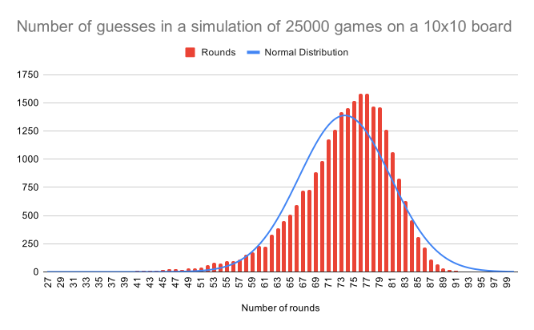
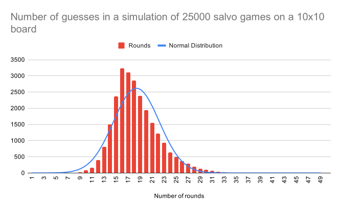

# Battleships

## Analysis of algorithm

This section has been split into two, the initial algorithm I used was purely random,
the algorithm would pick a random value on the X and Y coordinate and then attempt to 
destroy the relevant node. If the node was already destroyed or for some reason out of
bounds then the computer would guess again, this process would not increment the number
of guesses - only valid guesses have been recorded in the graphs below.

### Analysis of my random algorithm
#### 10x10 board - computer simulation - 25000 games

#### 10x10 board - computer simulation - 25000 salvo games

